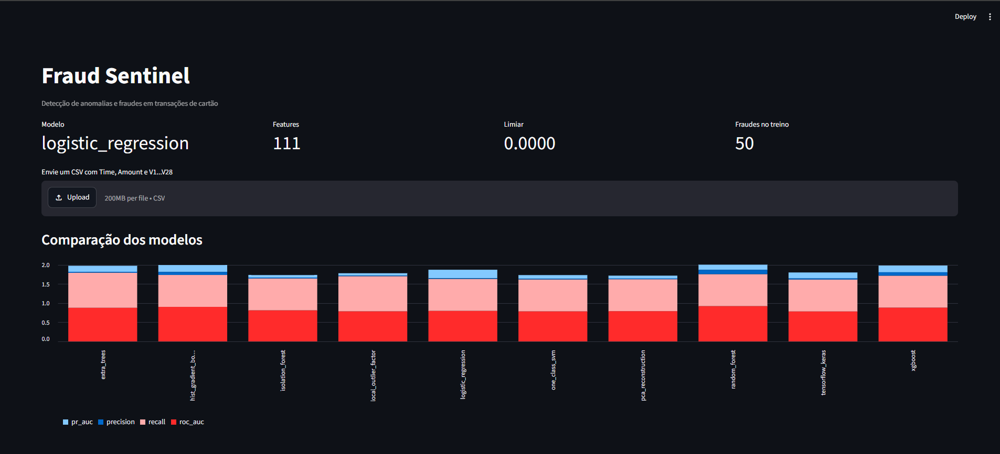

<div align="center">

# 🛡️ Fraud Sentinel

### Detecção de Anomalias e Fraudes em Transações de Cartão de Crédito

Sistema ponta a ponta de machine learning para identificar transações suspeitas em um cenário de desbalanceamento extremo.

[](https://www.python.org/)
[](https://scikit-learn.org/stable/)
[](https://xgboost.readthedocs.io/en/stable/)
[](https://www.tensorflow.org/?hl=pt-br)
[](https://docs.streamlit.io/)
[](https://fastapi.tiangolo.com/)

[](https://github.com/davidsonsilva/desafio-dio-fraudes-cartao-credito/commits/main)
[](https://github.com/davidsonsilva/desafio-dio-fraudes-cartao-credito)
[](tests/)

[📄 Relatório técnico](output/pdf/relatorio-tecnico-fraudes-cartao.pdf) · [🚀 Executar](#-execução-rápida) · [📡 API](#iniciar-a-api) · [📊 Dashboard](#iniciar-o-dashboard) · [📚 Referências](#referências)

</div>

---

## 📌 Sobre o projeto

O projeto utiliza o dataset público [Credit Card Fraud Detection](https://www.kaggle.com/datasets/mlg-ulb/creditcardfraud) e reúne preparação de dados, engenharia de mais de 100 features, dez modelos de machine learning e deep learning, tratamento profissional do desbalanceamento, seleção dinâmica de limiar, API REST, dashboard interativo, feedback auditável e relatórios PDF.

| Indicador | Valor |
|:--|--:|
| Transações no dataset | **284.807** |
| Fraudes confirmadas | **492** |
| Taxa de fraude | **0,173%** |
| Modelos comparados | **10** |
| Features após engenharia | **111** |
| Canais de inferência | **CLI + API + Dashboard** |

## 🧭 Navegação

- [Visão geral](#visão-geral)
- [Resultado do treinamento](#resultado-do-treinamento)
- [Arquitetura](#arquitetura)
- [Tecnologias](#tecnologias)
- [Processo de desenvolvimento](#processo-de-desenvolvimento)
- [Execução rápida](#-execução-rápida)
- [API e dashboard](#iniciar-a-api)
- [Testes e qualidade](#qualidade-e-testes)
- [Limitações](#limitações-e-próximos-passos)
- [Referências](#referências)

## Visão geral

O dataset contém **284.807 transações**, das quais apenas **492 são fraudes** — aproximadamente **0,173%**. Por isso, acurácia não é uma medida suficiente: um classificador que nunca detectasse fraude ainda teria mais de 99% de acurácia. Este projeto prioriza PR-AUC, recall, precisão e F1, além de registrar a matriz de confusão de cada modelo.

O sistema foi desenvolvido com os seguintes objetivos:

- comparar métodos supervisionados, de novidade e de detecção de anomalias;
- impedir vazamento de dados entre treino e teste;
- tratar o desbalanceamento de acordo com o tipo de estimador;
- calibrar o limiar de decisão conforme o custo operacional;
- compartilhar o mesmo artefato de inferência entre CLI, API e Streamlit;
- registrar feedback humano sem atualizar silenciosamente o modelo em produção;
- permitir validação local mesmo sem o CSV do Kaggle.

> Este software tem finalidade educacional e demonstrativa. Uso financeiro real exige validação independente, segurança, monitoramento de drift, explicabilidade, governança, revisão humana e conformidade regulatória.

## 📊 Resultado do treinamento

A captura abaixo mostra o dashboard Streamlit após uma execução demonstrativa do pipeline. Nessa execução, a regressão logística foi selecionada entre os dez modelos, com **111 features** geradas e **50 fraudes** presentes no conjunto sintético de treinamento.

<p align="center">
  
</p>

> Os números da imagem pertencem ao modo `--demo` e validam o funcionamento integrado do sistema. Eles não representam o desempenho final sobre as 284.807 transações do dataset real do Kaggle.

## Arquitetura

```text
Dataset Kaggle ou dados sintéticos
              │
              ▼
     Validação do contrato
              │
              ▼
 Divisão estratificada treino/teste
              │
              ▼
 Engenharia de mais de 100 features
              │
              ▼
         RobustScaler
              │
       ┌──────┴────────┐
       ▼               ▼
 SMOTE para modelos   Pesos de classe para
 sklearn clássicos    XGBoost e TensorFlow
       └──────┬────────┘
              ▼
      Treino de 10 modelos
              │
              ▼
 PR-AUC + threshold dinâmico
              │
              ▼
 Artefato versionado com modelo,
 transformações, métricas e limiar
       ┌──────┼──────────┐
       ▼      ▼          ▼
      CLI   FastAPI   Streamlit
                         │
                         ▼
                Feedback confirmado
                         │
                         ▼
                 Próximo retreinamento
```

## 🧰 Tecnologias

| Camada | Tecnologia | Responsabilidade |
|:--|:--|:--|
| Linguagem | Python 3.11–3.13 | Pipeline, treinamento, API e dashboard |
| Dados | pandas + NumPy | Leitura, validação e transformação tabular |
| Machine learning | scikit-learn | Modelos, preprocessing, métricas e anomalias |
| Desbalanceamento | imbalanced-learn | Geração de amostras sintéticas com SMOTE |
| Boosting | XGBoost | Classificação otimizada com peso de classe |
| Deep learning | TensorFlow/Keras | Rede neural densa com early stopping |
| API | FastAPI + Pydantic | REST, validação e documentação OpenAPI |
| Interface | Streamlit | Dashboard e classificação de arquivos CSV |
| Relatórios | ReportLab | Documentação e métricas em PDF |
| Persistência | joblib | Artefato treinado e transformações |
| Qualidade | pytest + Ruff | Testes automatizados e análise estática |

## Estrutura do projeto

```text
credit-card-fraud-detection/
├── app/
│   └── streamlit_app.py          # dashboard e análise em lote
├── data/raw/
│   └── creditcard.csv            # dataset local, ignorado pelo Git
├── feedback/
│   └── confirmed.csv             # rótulos confirmados, gerado em execução
├── models/
│   └── fraud_detector.joblib     # artefato selecionado, gerado no treino
├── reports/
│   ├── metrics.json              # métricas de todos os modelos
│   └── fraud_detection_report.pdf
├── output/pdf/
│   └── relatorio-tecnico-fraudes-cartao.pdf # documentação versionada
├── scripts/
│   └── download_data.py          # download autenticado pelo Kaggle
├── src/fraud_detection/
│   ├── api.py                    # endpoints FastAPI
│   ├── cli.py                    # comandos de treino e relatório
│   ├── config.py                 # caminhos e parâmetros centrais
│   ├── data.py                   # leitura, validação e modo sintético
│   ├── features.py               # engenharia de features
│   ├── feedback.py               # persistência de feedback humano
│   ├── inference.py              # inferência compartilhada
│   ├── models.py                 # catálogo dos dez modelos
│   ├── reporting.py              # geração do PDF
│   └── training.py               # treino, avaliação e seleção
├── tests/                        # testes de contrato e comportamento
├── Makefile
└── pyproject.toml
```

## Processo de desenvolvimento

### 1. Definição do problema

O primeiro passo foi tratar fraude como classificação extremamente desbalanceada, e não como um problema convencional de acurácia. Foram definidos PR-AUC e F1 como critérios de comparação, recall mínimo de 0,80 como restrição de calibração quando alcançável e matriz de confusão como evidência operacional.

### 2. Contrato e aquisição dos dados

O carregador exige `Time`, `Amount`, `Class` e `V1` até `V28`. O pipeline rejeita arquivos com colunas obrigatórias ausentes ou valores nulos. O CSV real é baixado diretamente do Kaggle e não é armazenado no repositório.

Para testes rápidos foi criado um gerador sintético com o mesmo contrato de 31 colunas. Esses dados validam a integração, mas não substituem os resultados obtidos com o dataset real.

### 3. Separação dos conjuntos

A divisão treino/teste é estratificada, preservando a proporção de fraudes, com `random_state=42` para reprodutibilidade. Toda transformação que aprende parâmetros — como escalonamento e SMOTE — é ajustada somente depois da divisão, usando apenas o conjunto de treino.

### 4. Engenharia de features

As 30 variáveis preditoras originais são convertidas em mais de 100 features. Entre elas:

- hora do dia em representação cíclica com seno e cosseno;
- indicador de período noturno e índice do dia;
- logaritmo, raiz, centavos e arredondamentos do valor;
- razão entre valor e tempo;
- interações entre `Amount`, `V1` e `V2`;
- módulo e quadrado de `V1` a `V10`;
- 45 interações par a par entre `V1` e `V10`;
- média, desvio-padrão, máximo absoluto e norma L2 de `V1` a `V28`.

Valores infinitos ou inválidos produzidos por transformações defensivas são normalizados para zero. O `RobustScaler` reduz a influência de valores extremos.

### 5. Tratamento do desbalanceamento

Não existe uma única técnica aplicada indiscriminadamente a todos os modelos:

- estimadores supervisionados clássicos do scikit-learn recebem dados balanceados por SMOTE somente no treino;
- XGBoost utiliza a distribuição original e `scale_pos_weight`, calculado como negativos divididos por positivos;
- TensorFlow/Keras utiliza a distribuição original e class weights;
- modelos de novidade são ajustados somente com exemplos normais;
- métodos de kernel e vizinhança usam uma amostra reprodutível de até 20.000 exemplos normais para controlar custo de memória e tempo.

Essa separação evita aplicar SMOTE e peso de classe simultaneamente ao mesmo modelo.

### 6. Treinamento dos dez modelos

| # | Modelo | Tipo | Estratégia de desbalanceamento |
|---:|---|---|---|
| 1 | Regressão Logística | Supervisionado | SMOTE + `class_weight=balanced` |
| 2 | Random Forest | Supervisionado | SMOTE + peso balanceado |
| 3 | Extra Trees | Supervisionado | SMOTE + peso balanceado |
| 4 | HistGradientBoosting | Supervisionado | SMOTE |
| 5 | XGBoost | Supervisionado | `scale_pos_weight` |
| 6 | TensorFlow/Keras | Deep learning | class weights + early stopping |
| 7 | Isolation Forest | Anomalia | somente transações normais |
| 8 | Local Outlier Factor | Novidade | `novelty=True`, somente normais |
| 9 | One-Class SVM | Novidade | somente transações normais |
| 10 | PCA Reconstruction | Anomalia | erro de reconstrução |

A rede Keras usa camadas densas de 64 e 24 unidades, dropout, saída sigmoide, binary cross-entropy, PR-AUC e early stopping com restauração dos melhores pesos.

### 7. Avaliação e threshold dinâmico

Cada modelo produz um score contínuo. Com a curva precision-recall, o pipeline procura o threshold que maximiza F1 entre os pontos que satisfazem o recall mínimo. Se nenhum ponto satisfizer a restrição, utiliza o melhor F1 disponível.

São registrados:

- PR-AUC ou Average Precision;
- ROC-AUC;
- precisão;
- recall;
- F1;
- matriz de confusão;
- threshold selecionado.

O vencedor é escolhido primeiro por PR-AUC e, em caso de necessidade de desempate, por F1.

### 8. Persistência e inferência

O arquivo `models/fraud_detector.joblib` armazena versão, data, engenharia de features, scaler, modelo vencedor, threshold, colunas de entrada, quantidade de features, métricas e estatísticas do dataset. O módulo de inferência valida as colunas recebidas e reutiliza exatamente as transformações ajustadas no treino.

### 9. API REST

FastAPI e Pydantic validam as 30 variáveis de entrada, impedindo valores negativos para `Time` e `Amount`. As respostas de inferência também possuem contratos explícitos e aparecem automaticamente no OpenAPI.

- `GET /health` — saúde do serviço e disponibilidade do artefato;
- `GET /model/info` — versão, modelo, threshold, features e dados do treino;
- `POST /predict` — previsão de uma transação;
- `POST /predict/batch` — previsão de até 1.000 transações;
- `POST /feedback` — grava um rótulo confirmado para retreinamento.

A documentação interativa fica disponível em `http://127.0.0.1:8000/docs`.

### 10. Interface Streamlit

O dashboard carrega o artefato uma única vez com `st.cache_resource`, apresenta indicadores do modelo, recebe um CSV, classifica as transações, ordena os maiores riscos, exibe os resultados e permite baixar `predictions.csv`. Também compara PR-AUC, ROC-AUC, recall e precisão dos dez modelos.

### 11. Autoaprendizado auditável

O endpoint de feedback não modifica imediatamente o modelo ativo. Transações confirmadas são anexadas a `feedback/confirmed.csv` e incorporadas automaticamente no próximo treinamento com o dataset real. Isso preserva rastreabilidade, permite revisão dos rótulos e evita alterações silenciosas em produção.

### 12. Relatório automático

O comando de relatório lê `reports/metrics.json` e gera `reports/fraud_detection_report.pdf`, contendo dados do treinamento, modelo vencedor e tabela comparativa de métricas.

### 13. Testes e validação

Os testes verificam:

- contrato e formato dos dados sintéticos;
- geração de pelo menos 70 features sem valores ausentes;
- alcance do recall mínimo pelo threshold quando possível;
- disponibilidade do endpoint de saúde sem modelo treinado;
- presença de exatamente dez modelos distintos;
- inclusão explícita de XGBoost e TensorFlow/Keras;
- presença de quatro modelos não supervisionados/de novidade.

## 🚀 Execução rápida

> [!TIP]
> Para apenas conhecer o sistema, use o modo demonstrativo. Ele gera dados sintéticos compatíveis, treina os dez modelos e cria o artefato consumido pelo dashboard.

```powershell
# 1. Preparar o ambiente
py -3.12 -m venv .venv
.venv\Scripts\Activate.ps1
python -m pip install --upgrade pip
pip install -e ".[dev]"

# 2. Treinar com 5.000 transações sintéticas
python -m fraud_detection.cli train --demo --rows 5000

# 3. Abrir o dashboard
streamlit run app/streamlit_app.py
```

Depois, acesse **[http://localhost:8501](http://localhost:8501)**.

| Objetivo | Comando | Saída principal |
|:--|:--|:--|
| Treinar demonstração | `python -m fraud_detection.cli train --demo --rows 5000` | `models/fraud_detector.joblib` |
| Treinar dataset real | `python -m fraud_detection.cli train --data data/raw/creditcard.csv` | Modelo e métricas reais |
| Abrir dashboard | `streamlit run app/streamlit_app.py` | `localhost:8501` |
| Iniciar API | `uvicorn fraud_detection.api:app --reload` | `127.0.0.1:8000/docs` |
| Gerar relatório | `python -m fraud_detection.cli report` | `reports/fraud_detection_report.pdf` |
| Executar testes | `pytest -q` | Resultado dos testes |
| Verificar código | `ruff check .` | Diagnóstico estático |

## Instalação detalhada

TensorFlow ainda não suporta todas as versões imediatamente após um lançamento do Python. Use Python **3.11, 3.12 ou 3.13**.

```powershell
cd "C:\Users\david\Documents\Codex\2026-07-16\us\outputs\credit-card-fraud-detection"
py -3.12 -m venv .venv
.venv\Scripts\Activate.ps1
python -m pip install --upgrade pip
pip install -e ".[dev]"
```

## Dataset real do Kaggle

Crie um token na sua conta Kaggle e use uma das opções abaixo.

Variáveis de ambiente:

```powershell
$env:KAGGLE_USERNAME="seu_usuario"
$env:KAGGLE_KEY="seu_token"
python scripts/download_data.py
```

Ou salve `kaggle.json` em `%USERPROFILE%\.kaggle\kaggle.json`. Depois execute:

```powershell
python scripts/download_data.py
python -m fraud_detection.cli train --data data/raw/creditcard.csv
```

## Execução sem Kaggle

O modo demo permite validar o pipeline com dados sintéticos:

```powershell
python -m fraud_detection.cli train --demo --rows 5000
python -m fraud_detection.cli report
```

As métricas do modo demo não devem ser apresentadas como desempenho real.

## Iniciar a API

```powershell
uvicorn fraud_detection.api:app --reload
```

Exemplo de resposta de `POST /predict`:

```json
{
  "fraud": false,
  "score": 0.0312,
  "threshold": 0.4821,
  "model": "xgboost"
}
```

A requisição deve incluir `Time`, `Amount` e todos os campos de `V1` a `V28`.

<details>
<summary><strong>Ver os endpoints disponíveis</strong></summary>

| Método | Endpoint | Finalidade |
|:--:|:--|:--|
| `GET` | `/health` | Verifica o serviço e a presença do modelo |
| `GET` | `/model/info` | Retorna modelo, versão, threshold e dataset |
| `POST` | `/predict` | Classifica uma transação |
| `POST` | `/predict/batch` | Classifica até 1.000 transações |
| `POST` | `/feedback` | Registra o rótulo confirmado |

</details>

## Iniciar o dashboard

```powershell
streamlit run app/streamlit_app.py
```

O CSV enviado deve conter as mesmas 30 colunas preditoras usadas no dataset. A coluna `Class` não é necessária para inferência.

## Gerar o relatório PDF

```powershell
python -m fraud_detection.cli report
```

O comando exige que um treinamento anterior tenha produzido `reports/metrics.json`.

Para recriar o relatório técnico versionado do projeto:

```powershell
python scripts/generate_project_pdf.py
```

## Qualidade e testes

```powershell
pytest -q
ruff check .
python -m compileall -q src app scripts tests
```

Também estão disponíveis comandos no `Makefile`: `install`, `test`, `lint`, `train-demo`, `api` e `ui`.

## Artefatos gerados

Os seguintes arquivos são produzidos em execução e ficam fora do controle de versão:

- `data/raw/creditcard.csv`;
- `models/fraud_detector.joblib`;
- `reports/metrics.json`;
- `reports/fraud_detection_report.pdf`;
- `feedback/confirmed.csv`.

## Limitações e próximos passos

- o dataset disponibiliza variáveis PCA anonimizadas, limitando explicações semânticas;
- a divisão aleatória é adequada à demonstração, mas produção deve incluir validação temporal;
- o pipeline ainda não implementa monitoramento automático de drift;
- o feedback precisa de autenticação e revisão antes de uso em ambiente real;
- o artefato joblib deve ser carregado somente de origem confiável;
- seria necessário medir latência, throughput e custo antes da implantação;
- explicabilidade com SHAP, rastreamento de experimentos e versionamento externo são extensões futuras, não dependências atuais.

## Referências

### Dataset

- [Kaggle — Credit Card Fraud Detection](https://www.kaggle.com/datasets/mlg-ulb/creditcardfraud)
- [TensorFlow — Classification on imbalanced data](https://www.tensorflow.org/tutorials/structured_data/imbalanced_data)

### scikit-learn

- [Documentação principal](https://scikit-learn.org/stable/)
- [Pipeline](https://scikit-learn.org/stable/modules/generated/sklearn.pipeline.Pipeline.html)
- [Metrics API](https://scikit-learn.org/stable/api/sklearn.metrics.html)
- [Precision-Recall](https://scikit-learn.org/stable/auto_examples/model_selection/plot_precision_recall.html)
- [Novelty and Outlier Detection](https://scikit-learn.org/stable/modules/outlier_detection.html)
- [RobustScaler](https://scikit-learn.org/stable/modules/generated/sklearn.preprocessing.RobustScaler.html)

### imbalanced-learn

- [SMOTE](https://imbalanced-learn.org/stable/references/generated/imblearn.over_sampling.SMOTE.html)

### XGBoost

- [Documentação principal](https://xgboost.readthedocs.io/en/stable/)
- [Python API — XGBClassifier](https://xgboost.readthedocs.io/en/stable/python/python_api.html)
- [Parâmetros — scale_pos_weight](https://xgboost.readthedocs.io/en/stable/parameter.html)
- [Tutoriais oficiais](https://xgboost.readthedocs.io/en/stable/tutorials/)

### TensorFlow/Keras

- [Documentação principal em português](https://www.tensorflow.org/?hl=pt-br)
- [Keras Sequential](https://www.tensorflow.org/api_docs/python/tf/keras/Sequential)
- [AUC metric](https://www.tensorflow.org/api_docs/python/tf/keras/metrics/AUC)
- [EarlyStopping](https://www.tensorflow.org/api_docs/python/tf/keras/callbacks/EarlyStopping)

### Streamlit

- [Documentação principal](https://docs.streamlit.io/)
- [st.cache_resource](https://docs.streamlit.io/develop/api-reference/caching-and-state/st.cache_resource)
- [st.file_uploader](https://docs.streamlit.io/develop/api-reference/widgets/st.file_uploader)
- [st.download_button](https://docs.streamlit.io/develop/api-reference/widgets/st.download_button)

### FastAPI

- [Documentação principal](https://fastapi.tiangolo.com/)
- [Request Body](https://fastapi.tiangolo.com/tutorial/body/)
- [Response Model](https://fastapi.tiangolo.com/tutorial/response-model/)
- [OpenAPI Docs](https://fastapi.tiangolo.com/reference/openapi/docs/)

## Licença e uso dos dados

Antes de redistribuir o dataset ou publicar resultados, consulte e respeite os termos apresentados na página original do Kaggle. As bibliotecas utilizadas mantêm suas próprias licenças.
